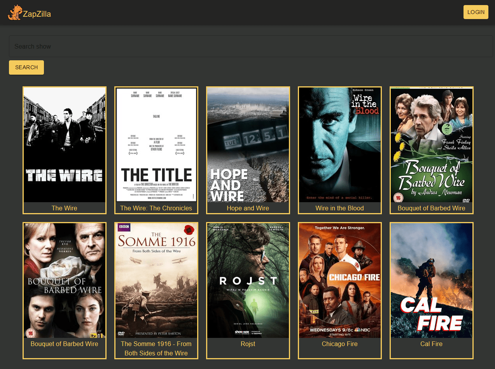
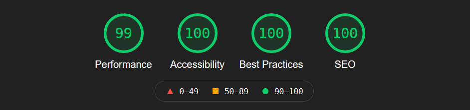

# Discover TV shows

React application that queries the [TVmaze API](https://www.tvmaze.com/api). Clicking on show image will send you to a detailed show page. Registered users can like shows to save them. On personal user page there is an overview of liked shows and the ability to delete them.

## Live Preview

https://zapzilla.netlify.app/

## Built With

* [React](https://reactjs.org/)
* [Express](https://expressjs.com/)
* [MongoDB](https://www.mongodb.com/)
* [JWT](https://jwt.io/)
* [Material-UI](https://mui.com/)
* [Formik](https://formik.org/)

## Lighthouse Score

## To do

- [x] Responsive design using CSS flexbox
- [x] Customized Material-UI
- [x] Routing w/ react router dom
- [x] Manage user login state w/ Context
- [x] JSON Web Token Authentication
- [x] Store users in MongoDB
- [x] Login input validation
- [x] Further styling
- [x] Users can save/delete likes
- [x] More user features (delete, edit)
- [x] Add authorisation routes